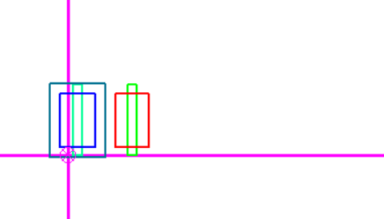
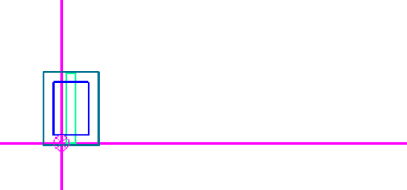
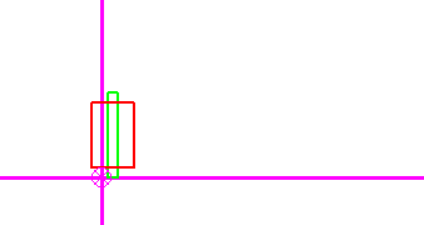

Тут будут расписаниы все примеры:
* Nothing - пустой файл
* 1_blue_1_red - 1 синий 1 красный

* 1_blue - 1 синий

* 1_red - 1 красный

А тут будут расписаны находки Гейдара:
У синих транзисторов самый внешний слой - P слой, затем идет NA слой
затем посередине - SP. Оба слоя находятся внутри P слоя, причем они идут в порядке
SP - NA - P
